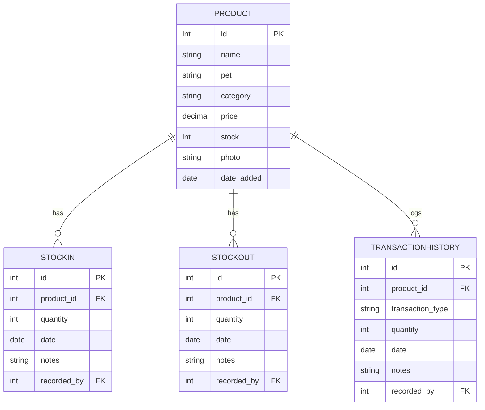

<<div align="center">


<br/>

<a href="https://git.io/typing-svg">
  
</a>

<br/><br/>

[


](https://www.python.org/)
[


](https://www.djangoproject.com/)
[


](https://www.sqlite.org/)
[


](https://getbootstrap.com/)
[


](#)

<br/>


</div>

<br/>

## About the Project

**Petshop Inventory Management System** is a web application built to fulfill the final project requirements for the **Data Structures and Algorithms** course. Instead of relying on database-level operations like `ORDER BY` or `LIKE`, all searching and sorting logic is implemented manually at the application layer using classic algorithms: **Linear Search**, **Binary Search**, **Bubble Sort**, **Selection Sort**, and **Insertion Sort**.

The system helps petshop owners and staff manage product inventory (Cat & Dog categories: food, vitamins, grooming, toys, and accessories), log stock in/out transactions, monitor visual analytics, and export reports to Excel and CSV.

<br/>

## Key Features

<table>
<tr>
<td width="50%" valign="top">

**Interactive Dashboard**
Real-time stat cards for total products, active stock volume, low/out-of-stock items, and category breakdowns via Chart.js.

**Smart Search**
Search products by name, category, or pet type using either Linear Search or Binary Search depending on performance needs.

**Algorithmic Sorting**
Sort the catalog by name, price, or stock using hand-written implementations of Bubble Sort, Selection Sort, and Insertion Sort.

</td>
<td width="50%" valign="top">

**Transaction Ledger**
Atomic stock in/out records with built-in validation to prevent stock from ever going negative.

**Professional Reports**
One-click export of inventory data to clean, well-formatted CSV or Excel (.xlsx) files.

**Audit & Access Control**
User activity logging (logins, product changes, data exports) plus role-based access control for Owner, Admin, and Staff.

</td>
</tr>
</table>

<br/>

## Application Preview

<div align="center">

**Dashboard**
<br/>


<br/><br/>

**Product Catalog**
<br/>


</div>

<br/>

## Tech Stack

| Layer | Technology |
|---|---|
| Backend | Python 3.11+, Django 4.2.x (custom decorators for RBAC) |
| Database | SQLite3 |
| Frontend | Bootstrap 5.3, Bootstrap Icons, Animate.css, custom CSS variables |
| Visualization | Chart.js (via CDN) |
| Data Export | `openpyxl`, Python's built-in `csv` module |

<br/>

## Understanding the Algorithms

<details>
<summary><b>Linear Search — O(n)</b></summary>
<br/>

Traverses the product list element by element from start to finish to find matches.

- **Pros**: flexible, works on unsorted data, and applies to any field.
- **Cons**: slows down as the number of products grows, since it scales linearly.
</details>

<details>
<summary><b>Binary Search — O(log n)</b></summary>
<br/>

Repeatedly halves the search interval. Requires the product list to already be sorted by **name**.

- **Pros**: extremely fast, even on large datasets.
- **Cons**: in this implementation, only applicable to the name search field.
</details>

<details>
<summary><b>Bubble Sort — O(n²)</b></summary>
<br/>

Compares adjacent products and swaps them if out of order, repeating until no more swaps are needed.

- **Pros**: simple to implement, with early-termination optimization if the data is already sorted.
- **Cons**: high average-case complexity, less suitable for large catalogs.
</details>

<details>
<summary><b>Selection Sort — O(n²)</b></summary>
<br/>

Splits the list into a sorted and unsorted portion, repeatedly moving the minimum/maximum element into place.

- **Pros**: fewer swap operations compared to Bubble Sort.
- **Cons**: always runs in O(n²) regardless of the initial order.
</details>

<details>
<summary><b>Insertion Sort — O(n²)</b></summary>
<br/>

Builds the sorted list one item at a time by inserting each product into its correct position within the already-sorted portion.

- **Pros**: very efficient for small or nearly-sorted datasets.
- **Cons**: inefficient for fully random or reverse-ordered data.
</details>

<br/>

## Algorithm Integration

All filtering and catalog configuration logic lives in `inventory/views.py`, inside the `_apply_product_filters()` function:

```python
# Extract parameters from the GET request
keyword = request.GET.get('q', '').strip()
search_algo = request.GET.get('search_algo', 'linear')
sort_algo = request.GET.get('sort_algo', 'bubble')
sort_by = request.GET.get('sort_by', '')
sort_order = request.GET.get('sort_order', 'asc')

# Search stage
if keyword:
    if search_algo == 'binary' and search_field == 'name':
        products = binary_search_by_nama(products, keyword)
    else:
        products = linear_search(products, keyword, field=search_field)

# Sort stage
if sort_by:
    ascending = (sort_order == 'asc')
    if sort_algo == 'selection':
        products = selection_sort(products, field=sort_by, ascending=ascending)
    elif sort_algo == 'insertion':
        products = insertion_sort(products, field=sort_by, ascending=ascending)
    else:
        products = bubble_sort(products, field=sort_by, ascending=ascending)

<br/>

## Folder Structure

```
Pet Shop Management System/
│
├── inventory/                  # Core app
│   ├── migrations/              # Database schemas
│   ├── static/                  # Static assets (logo, images, stylesheets)
│   ├── templates/                # HTML templates (inheriting base.html)
│   ├── admin.py                  # Admin registration
│   ├── algorithms.py             # Custom searching & sorting implementations
│   ├── constants.py              # Global constants (e.g. low-stock threshold)
│   ├── context_processors.py     # Global context variables (alert indicators)
│   ├── decorators.py             # Custom decorators for RBAC
│   ├── forms.py                  # Form definitions (products, users)
│   ├── models.py                 # Model definitions (Product, Transaction, Log)
│   ├── urls.py                   # App URL routing
│   ├── views.py                  # Application logic and controllers
│   └── tests.py                  # Test suite
│
├── petshop_inventory/           # Project settings module
│   ├── settings.py               # Main Django settings
│   ├── urls.py                   # Root URL router
│   └── wsgi.py                   # WSGI configuration
│
├── db.sqlite3                    # Database file
├── manage.py                     # Django CLI runner
├── requirements.txt              # Package dependencies
├── seed_data.py                  # Database seeding utility
└── setup_roles.py                # User accounts & groups setup utility
```

<br/>

## Database Schema (ERD)



<br/>

## Setup & Installation

**1. Clone the repository**
```bash
git clone https://github.com/username/repo-name.git
cd "Pet Shop Management System"
```

**2. Create a virtual environment**
```bash
python -m venv venv

# Windows (PowerShell)
.\venv\Scripts\Activate.ps1

# Windows (CMD)
.\venv\Scripts\activate.bat

# Linux/macOS
source venv/bin/activate
```

**3. Install dependencies**
```bash
pip install -r requirements.txt
```

**4. Run database migrations**
```bash
python manage.py migrate
```

**5. Set up default roles & accounts**
```bash
python setup_roles.py
```

**6. Seed sample data**
```bash
python seed_data.py
```

**7. Start the server**
```bash
python manage.py runserver
```

Open `http://127.0.0.1:8000/` in your browser to access the application.

<br/>

## Demo Accounts

| Username | Password | Role | Description |
|---|---|---|---|
| `owner` | `owner123` | Owner | Full access, including user management |
| `admin` | `admin123` | Admin | Manages products & transactions, cannot modify Owner |
| `staff1` | `staff123` | Staff | Restricted to stock in/out entry |

**Role Details**

- **Owner** — the top-level role. Can add admins, modify any account, view activity logs, export data, and delete any item.
- **Admin** — can view logs, export product data, and manage staff accounts. Cannot modify the Owner account.
- **Staff** — field operator, limited to recording stock in/out with no access to the user directory or activity logs.

<br/>

## Team

<div align="center">

| Name | Role |
|---|---|
| **Dallen Friedolin Manuel Daely** | Developer & Algorithm Architect |
| **Nabila F Andina Lubis** | UI/UX Designer & Template Developer |
| **Hani Septiani** | Database Administrator & Quality Assurance |

</div>

<br/>

<div align="center">

Built to fulfill the final project for Data Structures and Algorithms.


*Copyright © 2026. All rights reserved.*

</div>