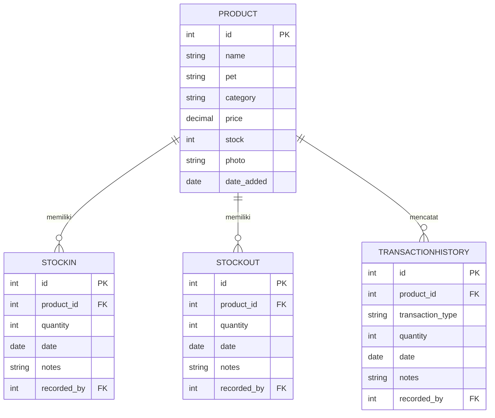

<div align="center">


<br/>

<a href="https://git.io/typing-svg">
  
</a>

<br/><br/>

[](https://www.python.org/)
[](https://www.djangoproject.com/)
[](https://www.sqlite.org/)
[](https://getbootstrap.com/)
[](#)

<br/>


</div>

<br/>

## Tentang Proyek

**Petshop Inventory Management System** adalah aplikasi web yang dikembangkan untuk memenuhi tugas akhir mata kuliah **Struktur Data & Algoritma**. Alih-alih mengandalkan query database bawaan seperti `ORDER BY` atau `LIKE`, seluruh proses pencarian dan pengurutan data diimplementasikan secara manual di level aplikasi menggunakan algoritma klasik: **Linear Search**, **Binary Search**, **Bubble Sort**, **Selection Sort**, dan **Insertion Sort**.

Sistem ini dirancang untuk membantu pemilik dan staf petshop mengelola inventori produk (kategori Cat & Dog: makanan, vitamin, grooming, mainan, dan aksesoris), mencatat riwayat transaksi stok masuk/keluar, memantau analitik secara visual, serta mengekspor laporan ke Excel dan CSV.

<br/>

## Fitur Unggulan

<table>
<tr>
<td width="50%" valign="top">

**Dashboard Interaktif**
Kartu statistik real-time untuk total produk, volume stok aktif, produk menipis/habis, dan distribusi kategori melalui grafik Chart.js.

**Pencarian Cerdas**
Cari produk berdasarkan nama, kategori, atau jenis hewan menggunakan Linear Search maupun Binary Search sesuai kebutuhan performa.

**Pengurutan Algoritmik**
Urutkan katalog berdasarkan nama, harga, atau stok memakai implementasi manual Bubble Sort, Selection Sort, dan Insertion Sort.

</td>
<td width="50%" valign="top">

**Buku Besar Transaksi**
Pencatatan stok masuk dan keluar yang atomik, lengkap dengan validasi agar stok tidak pernah minus.

**Laporan Profesional**
Ekspor data inventori sekali klik ke format CSV maupun Excel (.xlsx) dengan format yang rapi.

**Audit & Kontrol Akses**
Pencatatan aktivitas pengguna (login, perubahan produk, ekspor data) serta kontrol akses berbasis peran (Owner, Admin, Staff).

</td>
</tr>
</table>

<br/>

## Pratinjau Aplikasi

<div align="center">

**Dashboard**
<br/>


<br/><br/>

**Katalog Produk**
<br/>


</div>

<br/>

## Tumpukan Teknologi

| Layer | Teknologi |
|---|---|
| Backend | Python 3.11+, Django 4.2.x (custom decorator untuk RBAC) |
| Database | SQLite3 |
| Frontend | Bootstrap 5.3, Bootstrap Icons, Animate.css, custom CSS variables |
| Visualisasi | Chart.js (via CDN) |
| Ekspor Data | `openpyxl`, modul `csv` bawaan Python |

<br/>

## Memahami Algoritma

<details>
<summary><b>Linear Search — O(n)</b></summary>
<br/>

Menelusuri seluruh elemen daftar produk satu per satu dari awal hingga akhir untuk menemukan kecocokan.

- **Kelebihan**: fleksibel, bekerja pada data yang belum terurut, dan bisa diterapkan ke field apa saja.
- **Kekurangan**: melambat seiring bertambahnya jumlah produk karena kompleksitasnya linear.
</details>

<details>
<summary><b>Binary Search — O(log n)</b></summary>
<br/>

Membagi dua interval pencarian secara berulang. Mengharuskan daftar produk sudah terurut berdasarkan **nama** terlebih dahulu.

- **Kelebihan**: sangat cepat bahkan untuk dataset besar.
- **Kekurangan**: pada implementasi ini hanya berlaku untuk pencarian berdasarkan field nama.
</details>

<details>
<summary><b>Bubble Sort — O(n²)</b></summary>
<br/>

Membandingkan pasangan produk yang bersebelahan dan menukarnya jika urutannya salah, diulang hingga tidak ada lagi pertukaran.

- **Kelebihan**: mudah diimplementasikan, memiliki optimasi early-termination jika data sudah terurut.
- **Kekurangan**: kompleksitas rata-rata tinggi, kurang cocok untuk katalog besar.
</details>

<details>
<summary><b>Selection Sort — O(n²)</b></summary>
<br/>

Membagi daftar menjadi bagian terurut dan belum terurut, lalu berulang kali memindahkan elemen minimum/maksimum ke posisi yang tepat.

- **Kelebihan**: jumlah operasi tukar (swap) lebih sedikit dibanding Bubble Sort.
- **Kekurangan**: tetap berjalan pada O(n²) terlepas dari urutan awal data.
</details>

<details>
<summary><b>Insertion Sort — O(n²)</b></summary>
<br/>

Membangun daftar terurut satu per satu dengan menyisipkan setiap produk ke posisi yang tepat pada bagian yang sudah terurut.

- **Kelebihan**: sangat efisien untuk dataset kecil atau data yang sudah hampir terurut.
- **Kekurangan**: kurang efisien untuk data acak atau terbalik total.
</details>

<br/>

## Integrasi Algoritma

Seluruh logika filter dan konfigurasi katalog diproses di dalam `inventory/views.py`, melalui fungsi `_apply_product_filters()`:

```python
# Mengambil parameter dari request GET
keyword = request.GET.get('q', '').strip()
search_algo = request.GET.get('search_algo', 'linear')
sort_algo = request.GET.get('sort_algo', 'bubble')
sort_by = request.GET.get('sort_by', '')
sort_order = request.GET.get('sort_order', 'asc')

# Tahap pencarian
if keyword:
    if search_algo == 'binary' and search_field == 'name':
        products = binary_search_by_nama(products, keyword)
    else:
        products = linear_search(products, keyword, field=search_field)

# Tahap pengurutan
if sort_by:
    ascending = (sort_order == 'asc')
    if sort_algo == 'selection':
        products = selection_sort(products, field=sort_by, ascending=ascending)
    elif sort_algo == 'insertion':
        products = insertion_sort(products, field=sort_by, ascending=ascending)
    else:
        products = bubble_sort(products, field=sort_by, ascending=ascending)
```

<br/>

## Struktur Folder

```
Pet Shop Management System/
│
├── inventory/                  # Aplikasi inti
│   ├── migrations/              # Skema database
│   ├── static/                  # Aset statis (logo, gambar, stylesheet)
│   ├── templates/                # Template HTML (inherit dari base.html)
│   ├── admin.py                  # Registrasi admin
│   ├── algorithms.py             # Implementasi searching & sorting kustom
│   ├── constants.py              # Konstanta global (mis. batas stok menipis)
│   ├── context_processors.py     # Context variable global (indikator alert)
│   ├── decorators.py             # Decorator kustom untuk RBAC
│   ├── forms.py                  # Definisi form (produk, user)
│   ├── models.py                 # Definisi model (Product, Transaction, Log)
│   ├── urls.py                   # Routing URL aplikasi
│   ├── views.py                  # Logika dan controller aplikasi
│   └── tests.py                  # Test suite
│
├── petshop_inventory/           # Modul pengaturan proyek
│   ├── settings.py               # Pengaturan utama Django
│   ├── urls.py                   # Router URL root
│   └── wsgi.py                   # Konfigurasi WSGI
│
├── db.sqlite3                    # Berkas database
├── manage.py                     # CLI runner Django
├── requirements.txt              # Daftar dependency
├── seed_data.py                  # Utilitas seeding database
└── setup_roles.py                # Utilitas setup akun dan grup pengguna
```

<br/>

## Skema Database (ERD)



<br/>

## Instalasi & Menjalankan Proyek

**1. Clone repository**
```bash
git clone https://github.com/username/repo-name.git
cd "Pet Shop Management System"
```

**2. Buat virtual environment**
```bash
python -m venv venv

# Windows (PowerShell)
.\venv\Scripts\Activate.ps1

# Windows (CMD)
.\venv\Scripts\activate.bat

# Linux/macOS
source venv/bin/activate
```

**3. Install dependency**
```bash
pip install -r requirements.txt
```

**4. Jalankan migrasi database**
```bash
python manage.py migrate
```

**5. Setup role & akun default**
```bash
python setup_roles.py
```

**6. Seed data contoh**
```bash
python seed_data.py
```

**7. Jalankan server**
```bash
python manage.py runserver
```

Buka `http://127.0.0.1:8000/` di browser untuk mengakses aplikasi.

<br/>

## Akun Demo

| Username | Password | Peran | Deskripsi |
|---|---|---|---|
| `owner` | `owner123` | Owner | Akses penuh, termasuk manajemen pengguna |
| `admin` | `admin123` | Admin | Mengelola produk & transaksi, tidak bisa mengubah Owner |
| `staff1` | `staff123` | Staff | Terbatas pada input stok masuk/keluar |

**Rincian Peran**

- **Owner** — peran tertinggi. Dapat menambah admin, mengubah semua akun, melihat log aktivitas, mengekspor data, dan menghapus item apa pun.
- **Admin** — dapat melihat log dan mengekspor data produk, serta mengelola akun staff. Tidak bisa mengubah akun Owner.
- **Staff** — operator lapangan, hanya bisa mencatat stok masuk/keluar tanpa akses ke direktori pengguna atau log aktivitas.

<br/>

## Tim Pengembang

<div align="center">

| Nama | Peran |
|---|---|
| **Dallen Friedolin Manuel Daely** | Developer & Algorithm Architect |
| **Nabila F Andina Lubis** | UI/UX Designer & Template Developer |
| **Hani Septiani** | Database Administrator & Quality Assurance |

</div>

<br/>

<div align="center">

Dibangun untuk memenuhi tugas akhir mata kuliah Struktur Data & Algoritma.


*Copyright © 2026. All rights reserved.*

</div>
